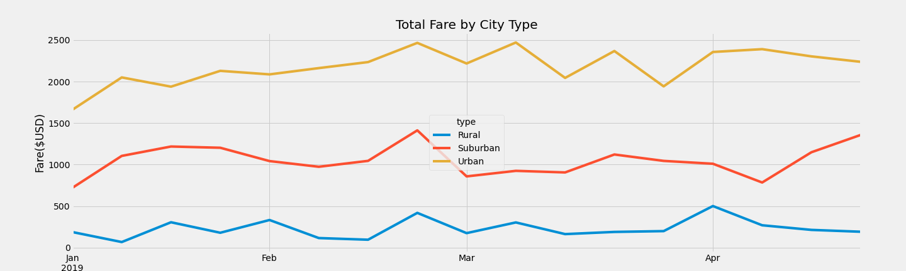

# PyBer Analysis

## Overview of the analysis

Purpose of the new analysis - Using Python and knowledge of Pandas, we created a summary DataFrame of the ride-sharing data by city type. Then, using Pandas and Matplotlib, we created a multiple-line graph that shows the total weekly fares for each city type.

## Results

**Summary DataFrame**

Using the Pandas groupby() function with the count() and sum() methods on PyBer DataFrame columns, we calculated the total number of rides, total number of drivers, and the total fares for each city type. Then, calculated the average fare per ride and average fare per driver for each city type. Finally, we add this data to a new DataFrame, then formatted the columns.

- The Urban city had more total drivers than total rides, which impacted the average fare per ride and average fare per driver. The Urban drivers earned significantly less than the Rural drivers. Also the Urban city had the lowest average fare per ride.

- The Rural city had the least number of total drivers and the highest average fare per ride. The rural city also have the highest average fare per driver.

**Total weekly fares by city type**

Using Pandas and two new functions, pivot() andresample(), we created a multiple-line graph that shows the total fares for each week by city type.

- The chart shows similar peak times in all these types of cities which is at the end of February. But for the Urban city, that oscillating peak lasts through April.

- The Rural city increases again in the month of April. The Suburban city starts to peak again at the end of April, while the Rural city type drops off.

## Summary

- The study can be more effective if we have data for the whole year rather than focusing on first few months.

- Rural Cities have less drivers and seems like it is under served, so increasing the number of driver can be an option but we need to know if the rural demands are met or not before making any decision.

- Number of drivers can be reduced in urban cities as reducing number of drivers will increase average fare per driver.
